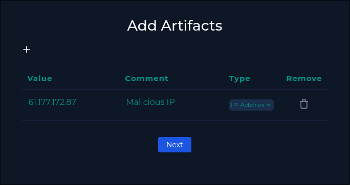

+++
date = '2025-08-23T08:28:22+05:30'
draft = false
title = 'whoami Command Detection in Request Body'
+++

Let's investigate a potential command injection alert on [letsdefend.io](https://letsdefend.io/)

The alert generated was: 

The request was sent to the URL `https://172.16.17.16/video/` (hostname is WebServer1004). 

Let's first take a look at the log files and filter for the URL in the raw logs. Filtering helps us skip through manually looking at each log which can get pretty tedious.

Taking a look at the detailed log output, we can see that the user ran `whoami` using the `c` post paramter. 

The user also ran 2 other commands, the most important of which is `cat /etc/shadow`. The shadow file contains the hashed passwords of the users which the attacker could potentially crack with a weak enough password.

Although it returns a response code of 200 (success) it might not have actually run the command. So we should check the host on endpoint security and see the terminal history.

The commands were run successfully which means the attacker succeeded, our next priority should be to isolate the machine and escalate the incident. The escalation is necessary due to the high severity of the vulnerability.

We will also add the malicious IP to the artifacts

## Is traffic malicious? 
Yes, clearly the attacker was trying to gain sensitive information from the system.

## What is the attack type? 
This is a command injection vulnerability that allows attackers to run arbitrary commands on the host system

## Was the attack a planned test?
Checking the emails, we don't see any indication that a test was planned during the time of the attack.

## What is the direction of traffic? 
The source IP is an IP that is outside the company network.
Internet -> company network

## Was the attack successful? 
Yes, we see 200 status codes and the corresponding command being run on the host.

## is a tier 2 escalation needed? 
Yes

## My analysis notes 

Any feedback is welcome as I am still learning, thank you for reading and have fun learning!

